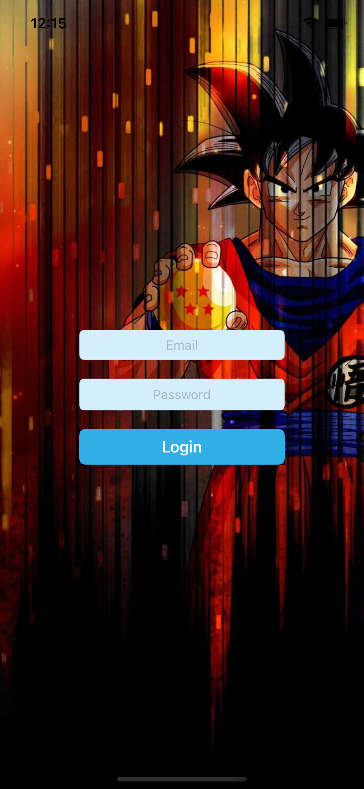
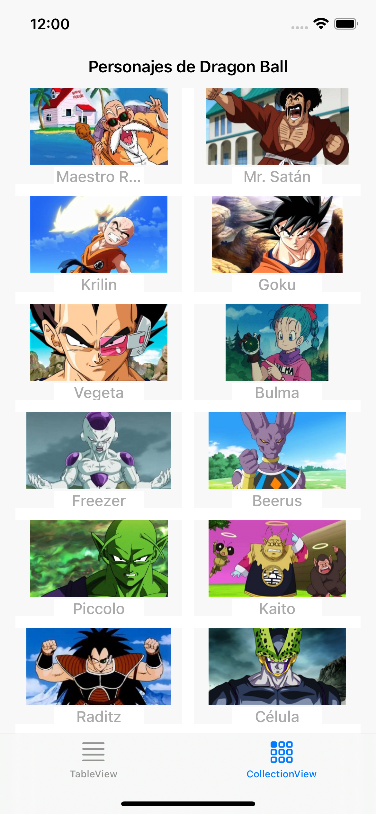
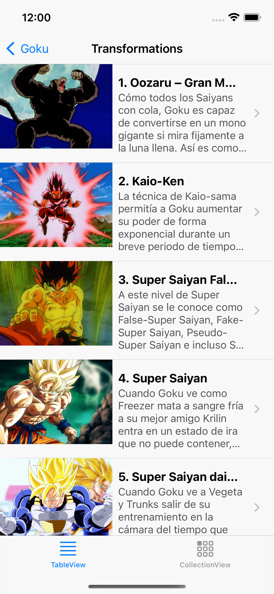
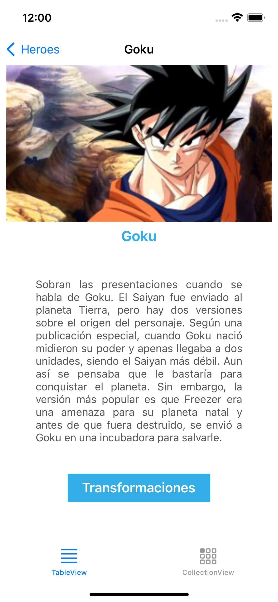
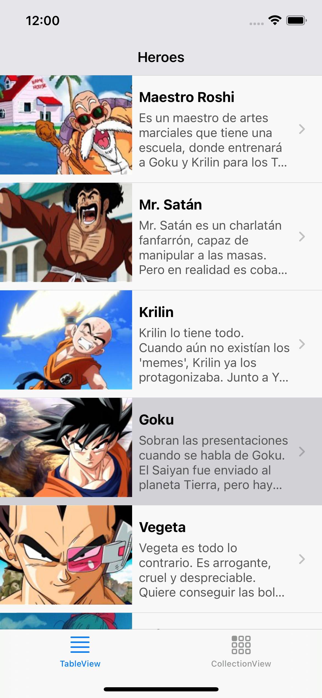

 # App móvil iOS que consume la API Rest Dragon Ball

[ - Práctica ](./Practica.pdf) 

[ - Proyecto ](./goku-api)

 # Imágenes del proyecto
 

 
 
 
 
 

__________
  ⌨️ with ❤️ by [Davina](https://www.linkedin.com/in/davinamedina/) 😊
